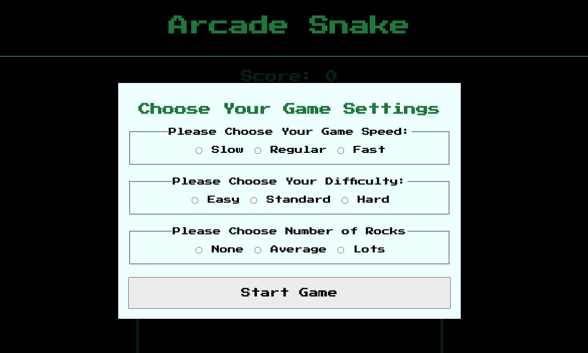
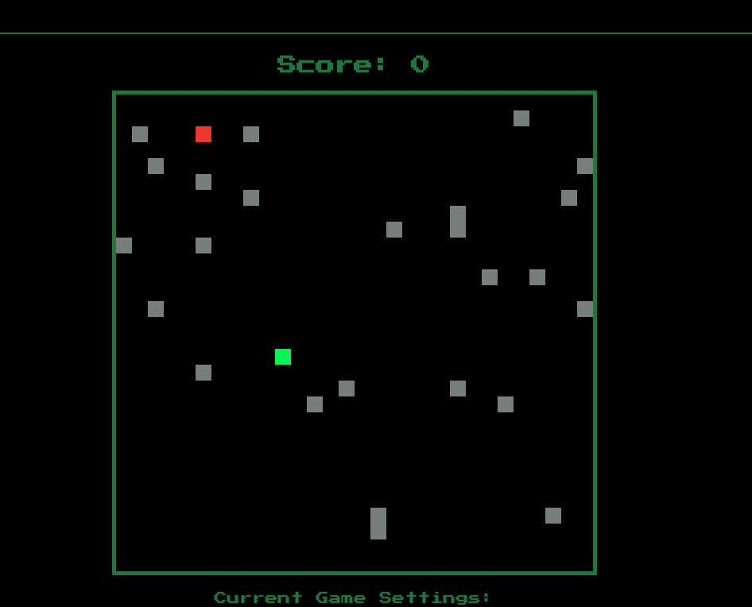
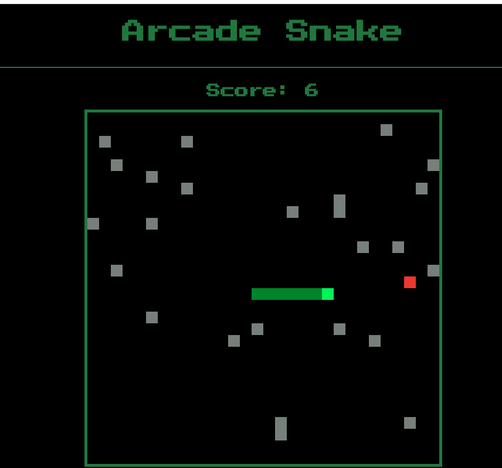

# Arcade Snake Game
Implementation of the classic arcade game snake.

## Table of Contents
* [Introduction]
* [Technologies](#technologies)
* [Setup](#setup)
* [Images](#images)
* [Features](#features)

## Introduction
The player can select a difficulty that will change the game rules. Easy will allow the snake to wrap through the walls. Medium will end the game if a player hits a wall. Hard will end the game if a player hits a will, and will increase the snakes speed each time a piece of fruit is eaten. Players can choose snake speed, and if they want to have obstacles, rocks, in the playing area.

## Technologies
* [Javascript]
* [CSS]
* [HTML]

## Setup
To run the game locally, simply run the HTML in a Google Chrome, or Firefox browser

## Images

## Features
* [Models built with vanilla Javascript for setting up your game and displaying final score]
* [Arrow key functionality, along with WASD functionality]
* [Secret cheet code to increas score and grow the snake without eating fruit]

TODO
* [Auto populate field with previous setting after playing first game]
* [Set up highest score tracker for app]